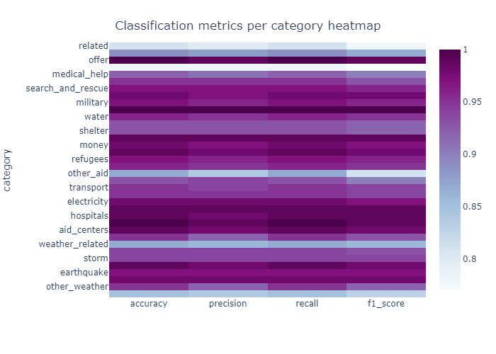

# Disaster Response Pipeline Project

### Table of Contents

1. [Project Motivation](#motivation)
2. [Installation](#installation)
3. [How to run](#run)
4. [File Descriptions](#files)
5. [Main results](#results)

## Project Motivation

In this project, I had to use data engineering skills, such as doing natural language preprocessing, to analyze disaster data from [Appen](https://appen.com/) (also know as Figure 8) to build a model for an API that classifies disaster messages in multiple categories.

With their dataset, I was able to develop a Machine Learning Pipeline to classify new messages in the same categories.

Also, this Machine Learning model can be tested using the available web application, that can be shown using the step by step in the "How to run" section.

## Installation 

Most of the libraries used on the project, such as pandas, numpy, matplotlib and tensorflow can be installed using the Anaconda distribution of Python.

You will need to install the following libraries used for reading the data, do natural language preprocessing and visualize the application in a web app:
 
 * sqlalchemy
 * pickle
 * gzip
 * plotly
 * kaleido
 * joblib
 * flask

The code should run with no issues using Python versions 3.*.

## How to run 

1. Run the following commands in the project's root directory to set up your database and model.

    - To run ETL pipeline that cleans data and stores in database  
        `python data/process_data.py data/disaster_messages.csv data/disaster_categories.csv data/DisasterResponse.db`
    - To run ML pipeline that trains classifier and saves  
        `python models/train_classifier.py data/DisasterResponse.db models/classifier.pkl`

2. Run the following command in the app's directory to run your web app.
    `python run.py`

3. Go to http://0.0.0.0:3001/ or http://localhost:3001/ to visualize the web app.

## File Descriptions 

The project have three main folders. The details of the files inside these folders can be seen below:

* *app:* contains the python files to run the web application locally. There is also a Jupyter Notebook to show case the visualizations made using the dataset.
* *data:* contains the csv files with the messages data and their respective categories. The _process_data.py_ file is used to read the data, do some data preprocessing and create the local database. 
* *models:* contains the python file that will read de preprocessed data on the database and train the Machine Learning model that will be used to predict the category of new messages on the web application.

## Main Results

The data was split into training and test sets. All the classification metrics, e.g. precision, accuracy, recall and F1 Score, for each category was above 0.75 on the test data.

A heatmap chart highlighting the categories where the model got better and worst results can be seen below:

